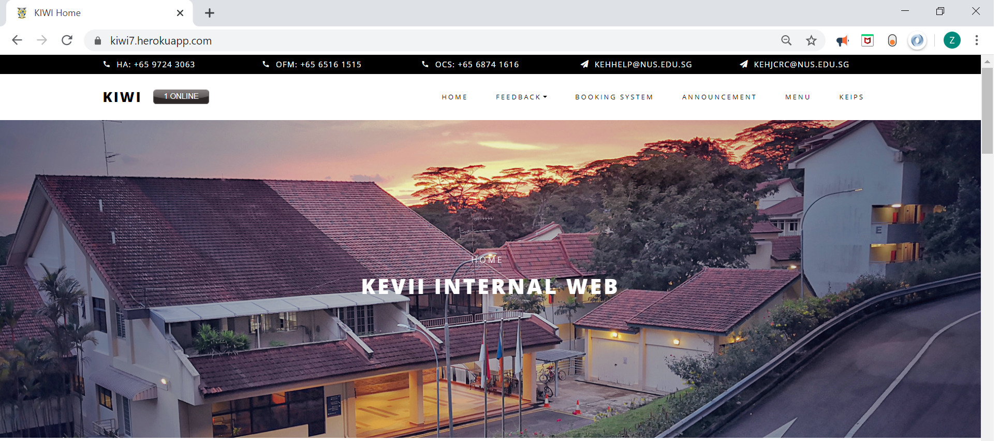

# web

# KIWI 

Hi, welcome to *KIWI*! 

**KIWI** is a website serves as King Edward VII Hall (KEVII) internal platform. **KIWI** is created to provide a centralised information platform hall residents.

Feel free to approach the developer for any feedback or questions!

**Main features**
* Latest announcements
* Upcoming events
* Feedback portal (residential life & facilities feedback)
* Venue booking system
* Menu of the day
* KEIPS (KEVII Internal Point System)
* More...

**Site Map**

* [Developer Guide](https://github.com/ziyun99/web/blob/master/doc/DeveloperGuide.adoc)
* [User Guide](https://github.com/ziyun99/web/blob/master/doc/UserGuide.adoc)
* [Management Guide](https://github.com/ziyun99/web/blob/master/doc/ManagementGuide.adoc)
* [About Us](https://github.com/ziyun99/web/blob/master/doc/AboutUs.adoc)